# MICB-475-Project-2-Team12

## Team meeting 1:

### Summary:
During this meeting the primary aim was to begin to think of the different project ideas that our group could do, as well as discuss what datasets the group gravitates towards. The group discussed two possible datasests that could be used, depression or cancer dataset. The cancer dataset is smaller, so the idea that was brought up was to combine it with another cancer dataset that the team finds. An idea that was suggested was to find a colon cancer dataset (the initial dataset was gastric cancer) and to compare functional and compositional diversity between the two groups, as well as examine iron utilization between microbiomes. The other idea was to examine the depression dataset, specifically examining in the metadata how hypertension and depression are connected, and how the gut microbiome affects them both. The future steps of the team was to see if any additional datasets could be found for the cancer project, and if nothing was successful then to choose to go with the depression dataset.

To Do:
- Find additional cancer datasets

Notes:
- Discussed possible metadata options; depression or cancer?
- Depression dataset has not been used before; needs more wrangling
- Cancer dataset has less variables; possibly combine data with other cancer datasets -> could combine to compare iron utilization between datasets of gut microbes 

## Team meeting 2: 

**Meeting Agenda:**

Goal: discuss datasets with the whole team present and decide on a project topic - review project ideas based on the background research we've done about the topics and the datasets we've found. Are the datasets good?

### Disscusion regarding the two samples:

idea 1: combine colorectal and gastric cancer
- discussion abt data sets
- very small dataset?
- gastric cancer one has a lot of healthy and stages samples
- gastric vs colorectal stages?
- filter gastric cancer to one site

idea 2: depression dataset
- and very well annotated
- depression & hypertension on health and the microbiome
- biologically backed up - microbiome affects health thru the cardiovascular syste,
- less limitations
- see if hypertension/depression vs normal, then combine cancer? no one has said they wanted to do this

The paper we got back had very few samples, the study could be can see how similar or different the CRC vs gastric cancer? The gastric database is very deep in detail, but doesn’t have many samples per site/
The depression dataset might be better since there is more data, and it’s simpler, lots of samples. 
Have it separate than combined 

**Meeting Notes:**

### Summary:
The team sent teaching team some papers with cancer samples, however the papers that were expected had very few samples. The team debated between the two for a bit before deciding to go with the depression dataset. The depression dataset was very well annotated and also has many samples. It was also biologically backed up due to previous literature indicating the microbiome affects depression and hypertension through the cardiovascular system. Therefore we decided to use the depression dataset 

#To do:
- Upload data into QIIME2, categorize metadata (priority is processing)
- Filter data, must do matas
- Do classification, classify metadata, clean metadata, metadata must match manifest so use your own manifest, make sure metadata and manifest are the same
- fix metadata (metadata is not priority, processing is), remove samples with no metadata and remove those same samples from teh manifest
- add column for what each depression scale value is classified clinically
- and QUIME (how spell) the data (ASVs and how many sample categories are left for each to see which variables are good to compare)
- dig into metadata and which which ones has the most samples
- look at their paper and steal the metadata: https://ojs.library.ubc.ca/index.php/UJEMI/article/view/200793 is paper, and github is at https://github.com/edsobcz/MICB475_Team8
- bajillion columns and a bunch of unapplicable data; the original paper https://ojs.library.ubc.ca/index.php/UJEMI/article/view/200793
- determine what depression testing to use PALMS or BDI score

#Notes:
- do all 100 samples?
- looked at integrase treatment
- previous student group only looked at coinfection one, not depression - go to their github and find their metadata which is more complete. if not, contact the team (TODO) sebastian, emily, emily
- if it has depression but not hypertension or vice versa, keep it?
- palms????????? catagorize if cliniclly depressed, slightly, or healthy (get the scale??)
- BDI scoring??? only has one measurement, choose one way to measure the depression. it also has ppl with 0 so those are control (just do depressed/non-depressed), so likely do this instead of palms HIV/HCV 
- Finalized: use the depression metadata → will need to annotate the data
- Linking depression with blood pressure
- Possibility; linking blood pressure to cancer, then to depression?
- First, must perform a Classification ( plateau → understand which category and variables are good to look at), then Filter out missing data, annotate (what's considered clinically depressed? Pick one; bdi (use this one; depressed vs non-depressed, don't use range) or poms)
- Filter for viruses and get only controls; see who has bdi of above 10
- Control; original dataset is based on depression, HIV etc. → only choose co-infected data
- Get the more completed metadata (look at Github)
- Manifest only the variables we need (do the same filtering you did for the metadata (same data)) --> but don’t be too biased 
- By October 26th; obtain the completed metadata, and classify and filter it (make sure the filtering matches the manifest data!)

## Team meeting 3

**Meeting Agenda**

What we did from last week:
- got second metadata file from previous team
- Metadata wrangiling: Filtered for HIV and hcv, found number of depressed (57) and not depressed(99) within this population

Goal: 
- determine best ways to work on the files
- determine how we want to document

Questions:
- would we be working with the dataset on the server or transferring it to our local computer
- can we move a copy of it into our data folder?
- is sample size big enough?
- should we remove some not depressed?
- What is wrong with Veronika's file (longmeta_phyloseq_rare.RData)?

**Meeting Notes**
Team meeting dicussions:
- We should equalize the sample number for depressed & not depressed
- The completed metadata doesn't include blood pressure results; must add and match with existing filtered out data (join data)
- 3 columns --> depression, blood pressure, & a column with both - "depression_highbp, depression_lowbp"
- Above 20 for bdi, considered depressed
- potentialy 3 categories for depression caterogization
- Filter out NAs for blood pressure result
- Must categorize blood pressure results --> make sure we still have enough sample
- Start proposal: (assignment 3 module) -  rarefraction etc. --> questions must be aided by literature with strong citations

For next week:
- divide up work for proposal
- finalize research questions

### Team meeting 4 Oct 21:

**Meeting Agenda**
Goals:
- Discuss and finalize research questions and specific aims- "How does the microbiome functionality differ across patients with high blood pressure, clinical depression, cormorbid conditions and patients with neither condition?" 
- Divide tasks for proposal (due Oct 26, this Sunday)
- Arrange a meeting at the end of week to discuss progress and proposal draft
- Discuss aim-specific approaches
  
Questions:
Our current research question is "How does the microbiome functionality differ across patients with high blood pressure, clinical depression, cormorbid conditions and patients with neither condition?" Would like to build our project on previous research done by Bruce et al, which identified an unique bacteria taxa and altered functional pathways linked to both mood and BP control in patients diagnosed with both conditions. The researchers studied wide scale gut microbiome functional genomic differences. We plan narrowing it down and study the function of specific species differentially abundant in each cohort. But is our research gap valid or strong enough? (https://www.sciencedirect.com/science/article/pii/S0002870321001228?via%3Dihub)

**Meeting Notes:**

- Sam suggested for us to not look at what the paper we found it did, so we discussed what are other things we could look at:
  -  Medication: look at the same matrix, but then add medication to our reseach matrix, however the medication had many N/As
  -  Diabetes: are metadata also has diabetes, microbiome vs diabetes and depression or microbiome vs diabetes and hypertension
  -  blood glucose
  -  calcium and other mineral things
 
  Did the paper look at a sex difference in the literature?
  - Sam said we could look at co-variables like sex or age, 
  -  We can stratify based on co-founders
    
  Current plan:
  - Look at if there is a gap in stratifying based on co-factor for a day, then pivot if we don't find literature to validate our reasoning to go forward.
  - Additional question, does our dataset look at type 1 or type 2 diabetes. Determined it is type 2 diabetes.
 
  Next, got feedback on our code:
  - Can it be more efficient ->  .x and .y showed up after left join, however it was fine.
  - can create a for loop to make hypertension
  - our matrix of depresseion vs hypertension has enough samples (even at our low of 18 samples)
    
 However if we are adding another stratifier then we might have too few samples, so we could lower the number that is our bdi cut off to include mild depression.
 However we determined based on size of dataset we can't have a matrix comparison of depresssion vs hypertension vs diabetes.
 If we do stratifying, the way we group ages is important and would maybe affect number of samples between groups, we would maybe need to split sampeles at a single age like 50, depends on literature review.

Idea: examine different groupings of stratification, so we can also look at both age and then sex.

Code: If we want to filter the manifest the same as the metadata, we just left join the manifest.

SAM: Cite all the tools we use, denoising, any databases, when we are making figures the figure legend at bottom, title at top, qiime processing use checklist. Teaching team wants to see if someone looked at sex difference and found it's important, then we should see if it's important when both are combined, while the paper just looks at if they are important seperately.
Additional note: estrogen related to female indivduals ability too absorb vitamin D, menopause stops at around specific age, which could be a point to look at and an interesting justification.

### Team meeting 5 Oct 28:

**Meeting Agenda:**

-discuss QIIME processing (show Sam where we're at ith it)
  -is how we've done the trimming good?
  -check sampling depth
  -whould we do more filtering to remove rare ASVs?

discuss the proposal
  -show Sam where we're at with it
  -how long is it usually? Does she have any general feedback fro things groups usually mess up?

**Meeting Notes**

Trimming at 150bp- to so all sequences same length, don't have to trim beginning 10bp
Filter to remove rare ASVs? yes we should add this step in 
sampling depth 20000 is good - trouble with seing samples all at once on the rarefaction curve is a bit weird but other teams have had this issue in the past

Research aims should directly stratify age and sex and look at microbiome
What is the clinical takeaway, talk about clinical implications in the introduction.
Determine the methods and specific aims, give background on each aim- why are we looking at this? 
step 1: qiime2 processing- each step, then aim-specific 
ASM citation style: american society for microbiology- zotero
In the final paper, title should be the conclusion but it's okay ith the title is general for now

### Team meeting 6 Nov 4th:

**Meeting Agenda:**

Topic 1: Proposal check in regarding approach and gantt page
  -present gantt chart and discuss plan for timeline

Topic 2: Presentation and Manuscript
  -specific feedback on aims from proposal
  -present on our project plan from the proposal and get feedback on plan
  
Topic 3: Check in regarding game plan (task splitting)
Topic 4: help with github - we are having trouble pushing and pulling we've just been uploading files we're confused about the github module

**Meeting Notes:**

Conversation of topic 1:
- agreed regarding timeline was in agreement to seperate out the aims and have each person do one portion of the aim
- Conversation regarding aim 2: we wanted to show that each group has a distinct composition, and show how distinct it is compared to the others
- Sam: DeSeq is comparing two groups, dependent analysis,
- we can look at the stratifiers using DeSeq, but should only compare those that are significantly different for alpha and beta diversity.
- People use beta diversity for composition being different, alpha is difference within itself, beta shows composition between, we should do beta and alpha in paralell, use the info of alpha and beta diversity to determine which we use for DeSeq
- SAM: for DeSeq we will find what is important from alpha and beta, also run PICRUst2 through order of importance

Conversation of topic 2:
- github push conversation, NOTE NAME BY THE DATE TO KNOW WHICH VERSION IS MOST RECENT
- for manuscript: make sure the comments are good since that is very important for the methods
- SAM clarified the presentation: most marks are about how we formated the slides/figures and whether our data supports our conclusions, most important conclusion is supported by our graph, put thoughts into future directions, great if the last meeting with evelyn the presetnation is done so we can confirm with her graph, future directiosns and conclusion with Evelyn
- We have a short amount of time to coach the team presenting our information, must be able to look at any graph that was taught

## Team Meeting 7 Nov 18th:

**Meeting Agenda**: 
-present the data below
-Ask for help with statistical tests (faiths PD and PERMANOVA)
-ask for help with PICRUSt2
-Ask about the feedback we recieved on the proposal

#Alpha diversity 
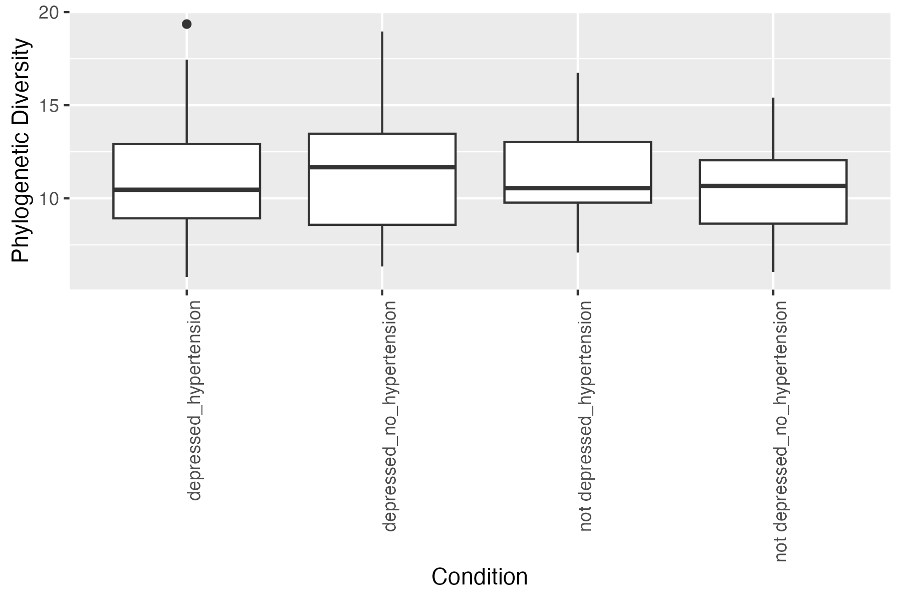
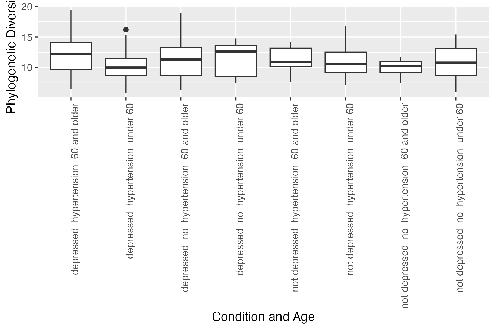
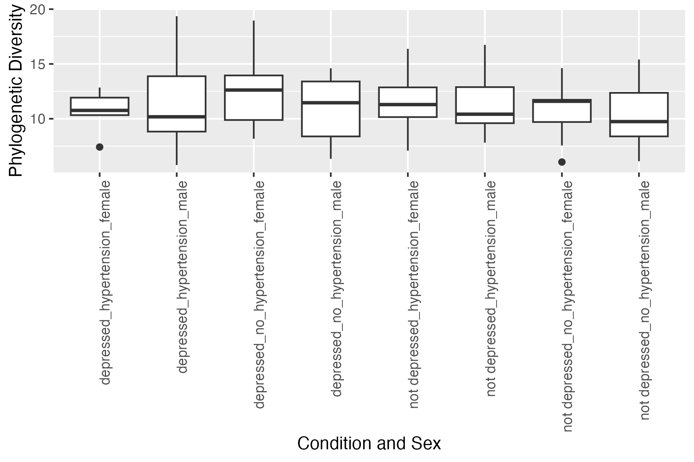
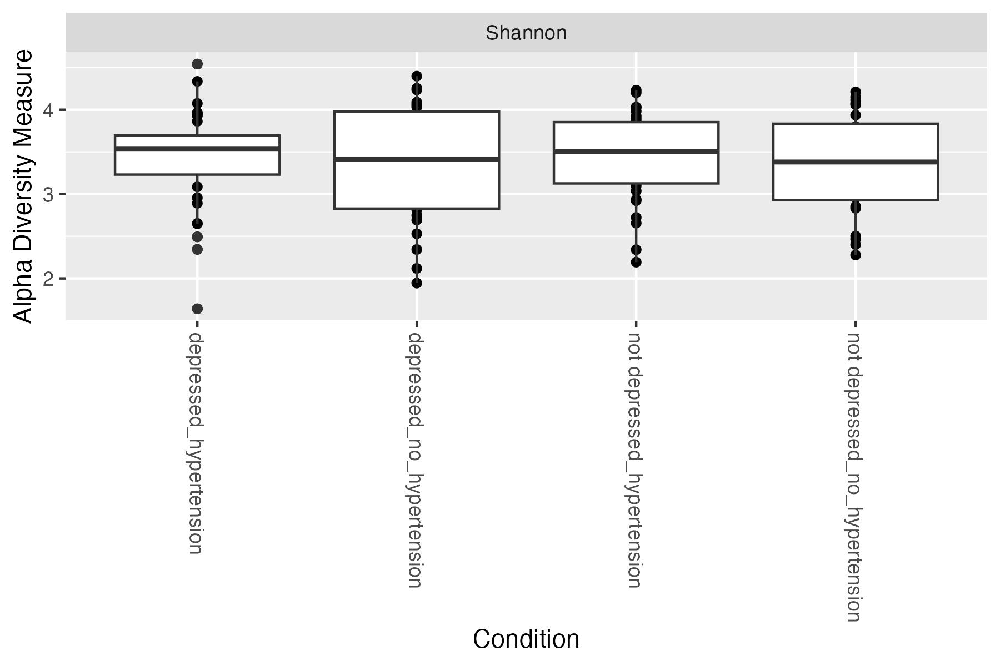
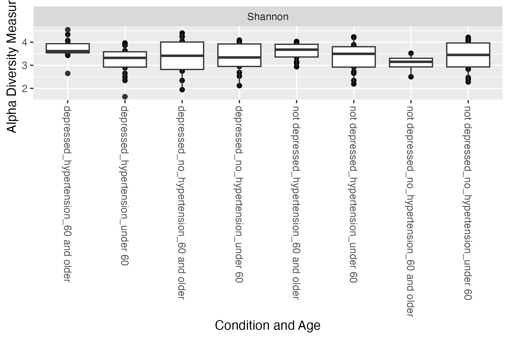
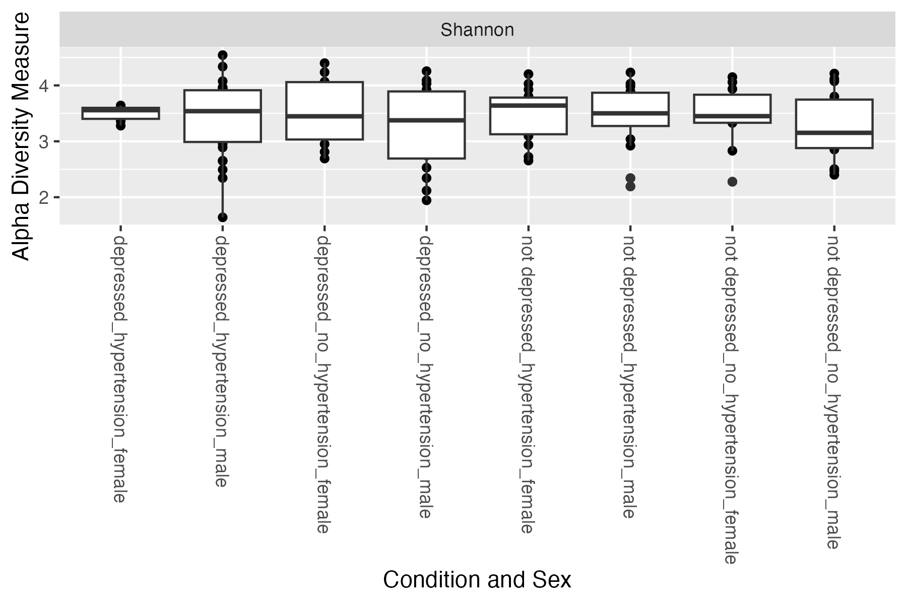
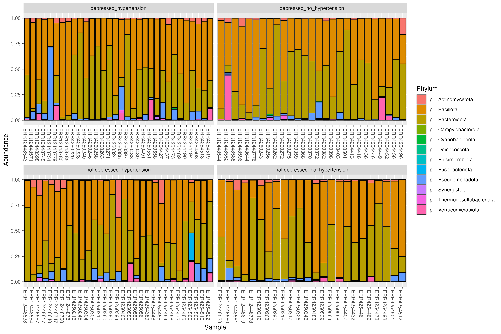
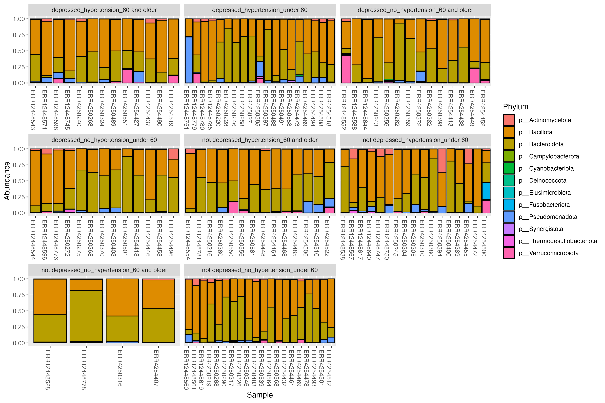
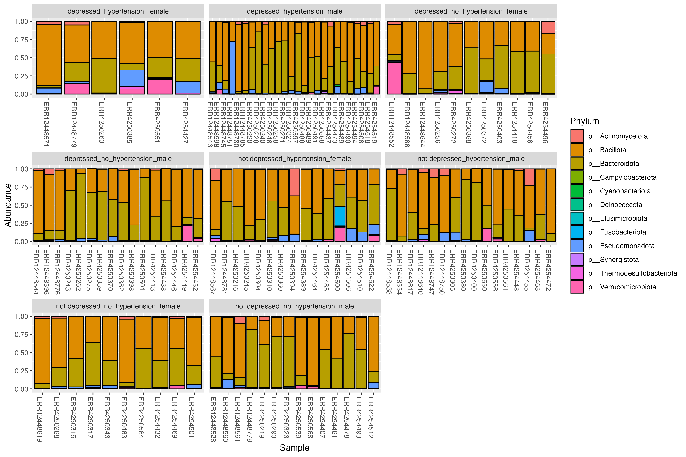

Ask - stat test for PD not working?
#Beta diversity
  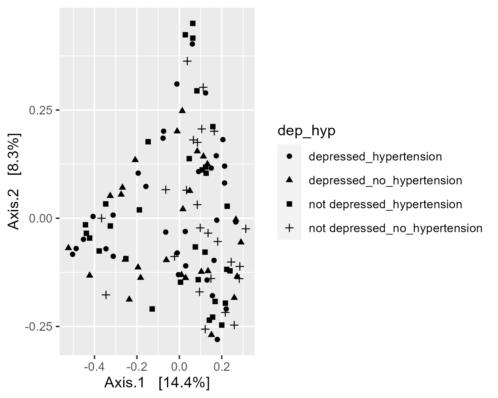
  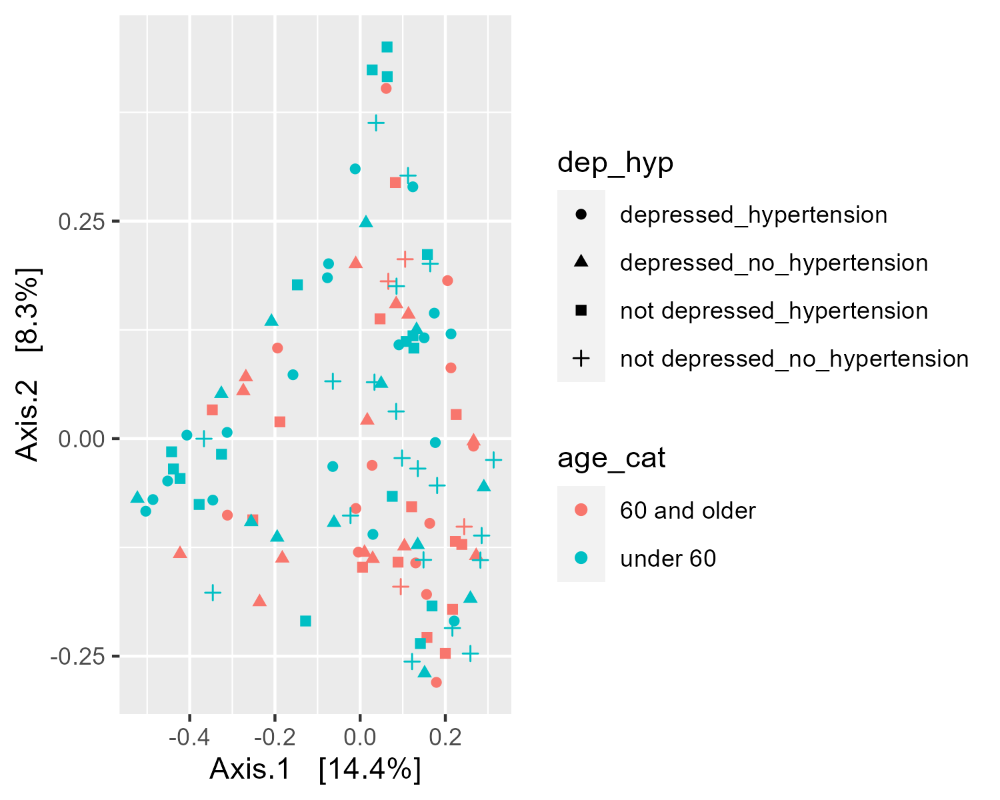
  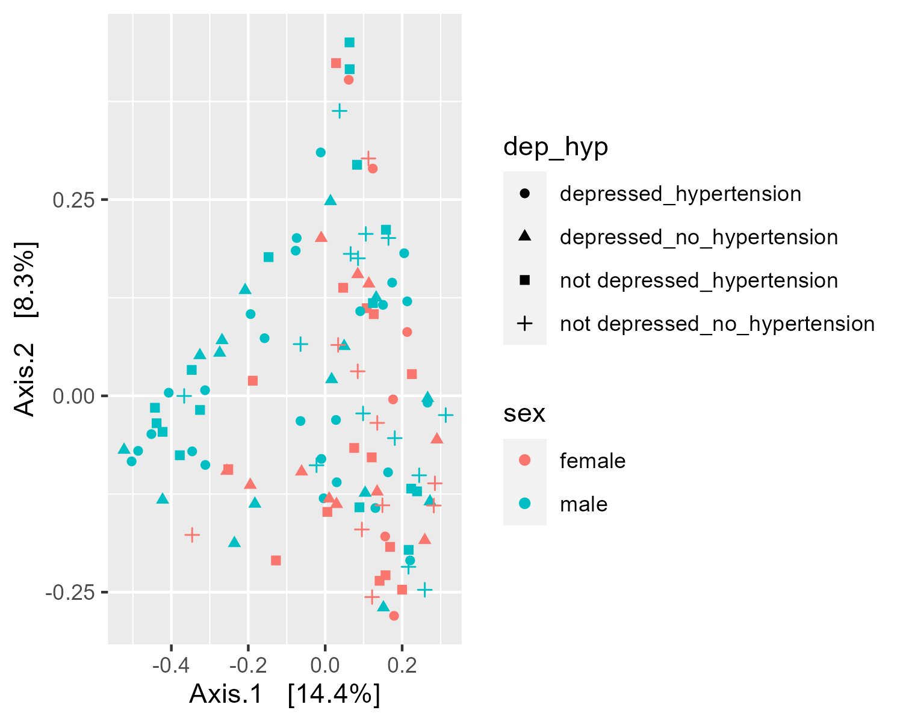

 Ask - how to properly do PERMANOVA?
 
#Picrust questions 
Current state: Error occurs during Command Line 
- Regardless of doing the same thing as the tutorial
- last step leads to error where only an intermediate file is made

#Proposal questions
  - project simplification?
      how can we modify though because its already so similar to what's been done. if we remove analyses how will it be different?
      focus on comorbidity and just control for age and sex - what does this mean? 
  -hypothesis: what do we need to add to make it more complete? functional stuff or hypretension/depression alone

**Meeting notes:**

looked at alpha diversity; found no sig. Differences between the depression hypertension variables, further separated diversity (PD) with age, but still not significant differences
(shannon) → also no difference 
Taxonomy bar plot study: Conclusion: at least within these ages & sex, no differences between the bacterial compositions 

Beta diversity graph → The low percentage for beta diversity indicates there aren't differences between the bacterial compositions despite having depression or hypertension.
--> Add circle for Confidence Interval (stat_elipse function)
Picrust analysis → essential if we aren’t seeing the differences (to see if there are any functional differences) —>  drop the sex and age --> Since we are looking at a different dataset than the previous study looking at the same question, we don't need to perform the sex and age statifiers BUT only for the funcional analysis, keep it for everything else 

Primary focus: see if there is a functional difference! and mention how the stratifiers don't have a significant impact on bacterial composition

Change research question: Looking at the differences between bacterial taxonomic and functional profiles in patients with hypertension, depression, or comorbidity, stratifying by sex and age

Add conclusion at the end of proposal --> add in limitations such as having limited samples, and what to look for next time 

Suggestions:
- Facet the graphs to see patterns between the ages (one for age one for sex) --> 4 panel figure
- Change the beta diversity graph; straitifers should be symbols and diseases should be colours
- taxa bar plots; include unstratified data, but leave teh stratified bar plots in the supplemental sections

## Team meeting 8 Nov 25th:

**Meeting Agenda:**
-present our graphs and data to Evelyn, Avril, and Sam and get feedback, 
-discuss plans for manuscript

**Meeting notes:**

These are the conclusions we came to from the discussion this meeting:

#to do:
-Beta diversity separate age groups onto different graphs, run a PERMANOVA
-PICRUSt2 split by age only
-Faith's PD email evelyn about stats
-Run DESeq
-change the theme of graphs to make them look better
-make a  powerpoint

Figure Layout for Manuscript:
Figure 1. Shannon and Bray curtis stratified by age
Figure 2. Shannon and bray curtis stratified by sex
Figure 3. Taxa bar plots 
Figure 4. Functional results (if significant)
Figure 5. DESeq (60 and older only)
Supplemental figure 1. Faiths diversity

# Team meeting 9 Dec 2nd:

Meeting agenda:
Discuss our data with teaching team:
-Alpha diversity is significant but beta is not - why is this?
-DESeq results are significant but what to do with them
-we are still struggling with PICRUSt2 why is it not working?

Changes to figure order:
Figure 1: 
- Alpha (include faiths so we can show it's abundance not phylogenetic differences changing the diversity)
- stratified as old vs young

Supplemental figure 1. Shannon and Bray curtis stratified by sex

Figure 2:
- Beta diversity

Avril agrees with our hypthesis - if capture is small in our bray curtis, then we can be missing the data that drives the alpha diversity difference
FOr the DESeq we only use unrarified, so we need to go back and fix these mistakes
Should add beta diversity plot for under 60 so it ties in
The DESeq could be supplemental

**Updates from Additional Meeting with Evelyn:**

Figure 1. alpha diversity stratified by age (observed features, shannons, and faiths)
Figure 2. Beta diversity stratified by age (Bray Curtis)
Figure 3. taxa bar plots
Figure 4. DESeq
  -are the taxa differences in hypertension vs comorbidity the same or different?
  -both volcano plots and bar plots
  -over 60 only - put under 60 in the supplemental?
Figure 5. (table 1) PICRUSt2
  -no major differences in functional pathways - Evelyn says 3 pathways is not significant
  -discussion: link to deseq, changes in taxa are not functional
Supplemental figure 1. Alpha diversity stratified by sex

Future directions:
  -short term - indicator taxa analysis
  -long term - thnk what would be the perfect study

Limitations:
  -classification ofo hypertension and depression from metadata

